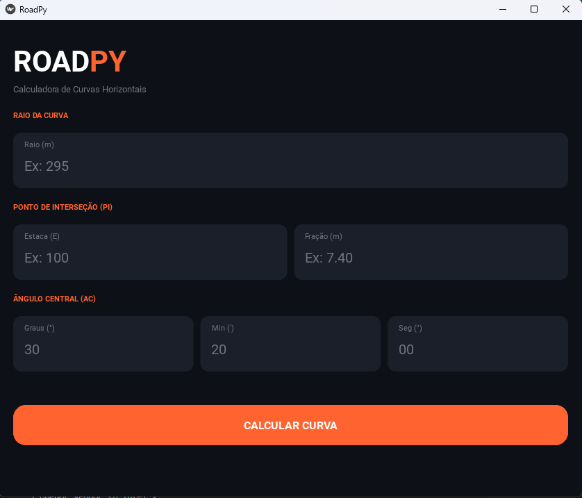

# RoadPy 🛣️
**Calculadora de Curvas Horizontais – UFRGS / IGEO / NGA**

App mobile Android desenvolvido em Python/Kivy para cálculo de elementos de curvas de concordância horizontal, seguindo o padrão DNIT (IPR-742).

## 📱 Interface

 

---
## 🎯 Problema

O cálculo manual de curvas horizontais é suscetível a erros e exige múltiplas etapas repetitivas.

O RoadPy automatiza esse processo, garantindo precisão e agilidade no projeto geométrico de rodovias.

## 📊 Exemplo de uso

Entrada:
- Raio: 295 m
- PI: 100 + 7.40
- Ângulo: 30°20'00"

Saída:
- T = 79.96 m
- D = 156.17 m
- PC = E96+7.44
- PT = E104+3.62
  
## Funcionalidades (v1.0)

| Elemento | Descrição |
|---|---|
| **Corda** | Determinação automática pela tabela DNIT (5 / 10 / 20 m) |
| **Tangente (T)** | `R · tan(AC/2)` |
| **Desenvolvimento (D)** | `R · AC · π / 180` |
| **Afastamento (E)** | `R · (1/cos(AC/2) − 1)` |
| **Corda Longa** | `2R · sin(AC/2)` |
| **Grau da Curva (Gc)** | `180 · c / (R · π)` |
| **Deflexão / Metro (dm)** | `Gc / (2c)` |
| **Deflexões Parciais** | PC, Corda padrão, PT |
| **PC** | Ponto de Curvatura (estaca + fração) |
| **PT** | Ponto de Tangência (estaca + fração) |
| **Estaqueamento** | Tabela completa de deflexões acumuladas |
| **Diagrama** | Visualização geométrica da curva |

---

## Requisitos de Desenvolvimento

- Python **3.10+**
- Kivy **2.3.0** → `pip install kivy==2.3.0`
- Buildozer (para gerar o APK Android) → `pip install buildozer`

---

## Executar no Desktop (para testar)

```bash
cd roadpy/
pip install kivy==2.3.0
python main.py
```

---

## Gerar APK Android

### 1. Instalar dependências (Linux / WSL)
```bash
sudo apt update
sudo apt install -y \
    python3-pip build-essential git python3-dev \
    ffmpeg libsdl2-dev libsdl2-image-dev \
    libsdl2-mixer-dev libsdl2-ttf-dev \
    libportmidi-dev libswscale-dev libavformat-dev \
    libavcodec-dev zlib1g-dev \
    libgstreamer1.0 gstreamer1.0-plugins-base \
    gstreamer1.0-plugins-good \
    openjdk-17-jdk

pip install buildozer
```

### 2. Build
```bash
cd roadpy/
buildozer android debug
```

O APK será gerado em `bin/roadpy-1.0.0-debug.apk`.

### 3. Instalar no dispositivo (via USB com ADB ativo)
```bash
buildozer android debug deploy run
```

---

## Estrutura do Projeto

```
roadpy/
├── main.py          # App Kivy (UI + screens)
├── calculator.py    # Motor de cálculo (fórmulas DNIT)
├── buildozer.spec   # Configuração de build Android
└── README.md        # Este arquivo
```

---

## Referências

- DNIT. **Manual de Projeto Geométrico de Rodovias Rurais** – Publicação IPR-742. Rio de Janeiro, 2010.
- TULER, M.; SARAIVA, S. **Fundamentos de Topografia**. Porto Alegre: Bookman, 2014.
- Disciplina TAEC (GEO05039) – Prof. Marciano Carneiro – UFRGS/IGEO/DGEO.

---

*RoadPy v1.0 — Próximas versões: locação por coordenadas, curvas com transição espiral, exportação PDF.*
